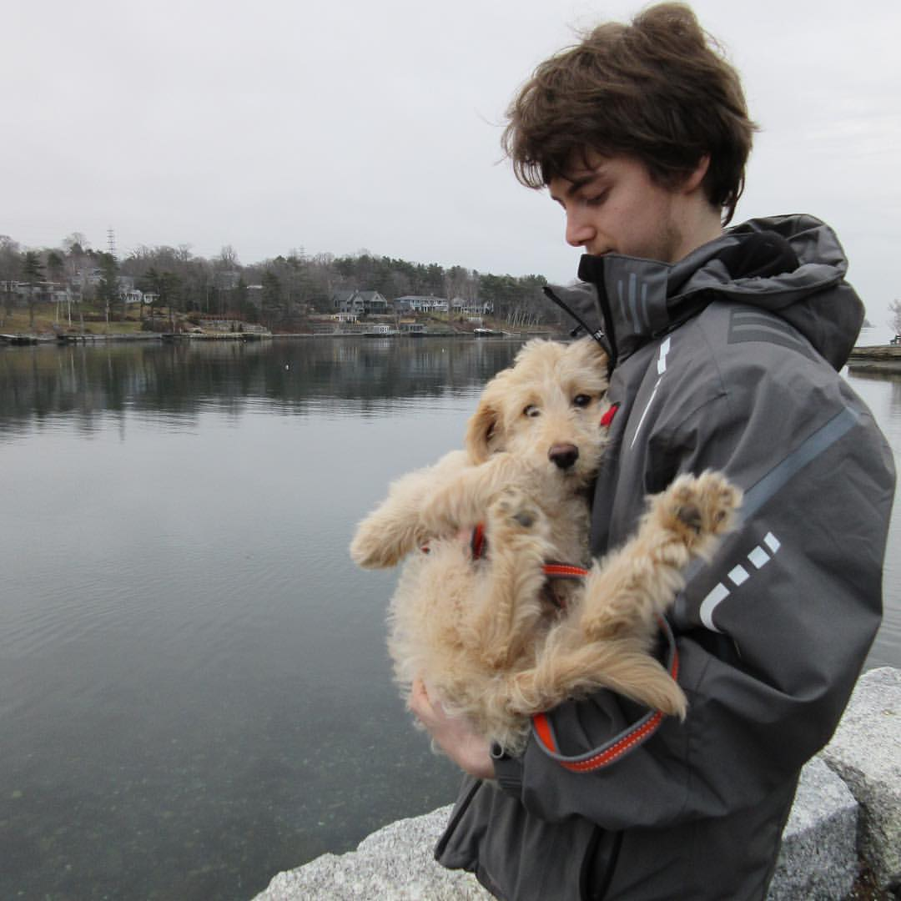
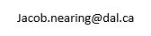

```{r setup, include=FALSE}
knitr::opts_chunk$set(echo = TRUE)
```


```{css, echo=FALSE}

body .main-container {
max-width: 1200px;
}

.fa{
    color: black;
    font-size: 200px;
}


p {
  margin-top: 30px;
  #line-height: 200%
}


h1, h2, h3 {
   text-align: center;
}
```

<p>
:::: {.columns}
::: {.column width="40%"}


</img>


:::
::: {.column width="5%"}
:::
::: {.column width="55%"}

<font size="20"> About </font>

<font size="5">I am a Postdoctoral Fellow at the Harvard T.H. Chan School of Public Health and the Broad Institute of MIT and Harvard, working in the lab of [Dr. Curtis Huttenhower](https://huttenhower.sph.harvard.edu/home). I completed my PhD in Microbiology and Immunology at Dalhousie University under the supervision of [Dr. Morgan Langille](https://morganlangille.com).

My research focuses on analyzing high-throughput sequencing data of microbial communities. I develop bioinformatic tools and work on microbiome epidemiological studies. For my most recent publications, visit my [Google Scholar](https://scholar.google.com/citations?user=ZRZfufoAAAAJ&hl=fr).

:::
::::

</p>

&nbsp;
<hr />

<h1>
  Follow me to see my latest works

<!-- Add icon library -->
<link rel="stylesheet" href="https://cdnjs.cloudflare.com/ajax/libs/font-awesome/4.7.0/css/font-awesome.min.css">
<link rel="stylesheet" href="/path/to/folder/css/academicons.min.css"/>

<!-- Add font awesome icons -->
<p style="text-align: center;">
    <a href="https://twitter.com/JTNearing" class="fa fa-twitter" style="font-size:50px;"></a>
    <a href="https://github.com/nearinj/" class="fa fa-github" style="font-size:50px;"></a>
    <a href="https://scholar.google.ca/citations?user=ZRZfufoAAAAJ" class="fa fa-graduation-cap" style="font-size:50px;"></a>
    
</p>
</h1>

&nbsp;
